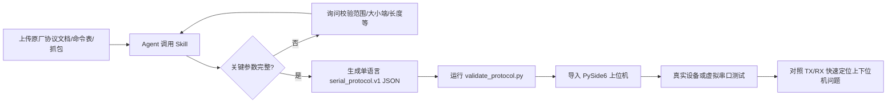
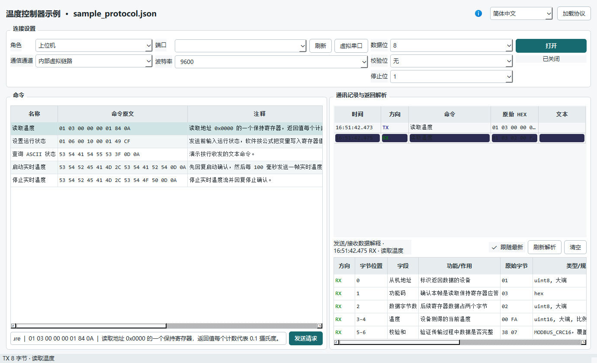

<p align="center">
  
</p>

<h1 align="center">Serial Protocol Tester Skill / 串口协议转换 Skill</h1>

<p align="center">从原厂串口协议文档快速生成可执行 JSON 和功能测试上位机<br>Turn vendor serial specifications into executable JSON and a working test console</p>

<p align="center">
  <a href="https://github.com/10walnut/serial-protocol-tester-skill/stargazers"></a>
  <a href="https://github.com/10walnut/serial-protocol-tester-skill/releases"></a>
  <a href="https://github.com/10walnut/serial-protocol-tester-skill/actions/workflows/test.yml"></a>
  <a href="LICENSE"></a>
</p>

<p align="center">
  <a href="https://ko-fi.com/B7J7268GW1"></a>
</p>

<p align="center">
  <a href="#中文">中文</a> · <a href="#english">English</a> ·
  <a href="https://github.com/10walnut/serial-protocol-tester-skill/releases/latest/download/serial-protocol-tester-skill.zip">下载 Skill ZIP</a> ·
  <a href="https://github.com/10walnut/serial-protocol-tester-app">PySide6 上位机</a>
</p>

## 中文

这个 Skill 读取原厂串口协议文档、Word/PDF/Markdown、Excel 命令表、抓包和示例帧，输出标准 `serial_protocol.v1` JSON。生成结果可直接导入配套软件，把原始资料快速变成可发送命令、接收应答、模拟上下位机并解释每个字节的功能测试上位机。

它把“读协议、写测试界面、实现组帧解帧”压缩为一条可复用流程。测试时可对照协议预期、实际 TX 和实际 RX，快速判断问题位于上位机实现、下位机响应、协议脚本还是串口链路；测试完成后，配套软件也可继续作为简单功能的上位机使用。

### 它解决什么问题

- 从资料中提取波特率、数据位、帧头、长度、命令、应答、大小端、比例、单位、枚举和校验范围。
- 注释、字段名称和说明只输出用户指定的一种语言，避免同一 JSON 中英文混排。
- 日期、时间、地址、传感器和标定值使用可编辑变量与公式，不把动态值写死。
- 一条请求可先回复 ACK，再延迟或每 100 ms 周期回复，并由停止命令结束数据流。
- 每个有意义的 TX/RX 字节都有位置、用途、原始值和计算过程。
- 生成后使用纯 Python 标准库校验，不依赖桌面软件或 PySide6。
- 配合 App 直接生成按钮式测试界面，减少为每份原厂协议重复编写临时上位机的工作。

### 三分钟安装

#### 豆包

1. 下载 [serial-protocol-tester-skill.zip](https://github.com/10walnut/serial-protocol-tester-skill/releases/latest/download/serial-protocol-tester-skill.zip)。
2. 在豆包进入“技能新建”→“上传技能”。
3. 直接上传 ZIP；压缩包根目录已经包含 `SKILL.md`。

#### Codex / Claude Code / WorkBuddy / Harness

```powershell
git clone https://github.com/10walnut/serial-protocol-tester-skill.git
cd serial-protocol-tester-skill
```

| 客户端 | Windows 安装命令 |
| --- | --- |
| Codex | `.\install.ps1 -Target codex` |
| Claude Code | `.\install.ps1 -Target claude` |
| WorkBuddy | `.\install.ps1 -Target workbuddy` |
| Harness / 项目 Skills | `.\install.ps1 -Target harness` |
| 自定义目录 | `.\install.ps1 -Target custom -Destination "D:\agent-skills\serial-protocol-tester"` |

WorkBuddy 需要先配置 `WORKBUDDY_SKILL_DIRS`，也可以直接传入 `-Destination`。Linux/macOS 使用 `./install.sh codex`、`./install.sh claude` 或 `./install.sh custom <目录>`。

### 标准流程



1. 上传协议原文和至少一条真实报文；资料越完整，字段解释越准确。
2. 指定输出语言，例如“只输出中文 JSON，不要中英混合”。
3. 说明模拟角色和时序，例如“先 ACK，100 ms 后开始周期数据”。
4. 要求 Agent 列出不能确定的校验范围、字节序、符号位或长度定义，不允许猜测。
5. 生成后运行校验器，修复所有错误，再导入软件。



### 提示词示例

基础转换：

```text
使用 serial-protocol-tester Skill 读取我上传的协议。
只输出中文 serial_protocol.v1 JSON，不要中英文混合。
每个发送和接收字段写明字节位置、作用、类型和计算过程。
生成后运行校验器，并单独列出文档中无法确定的内容。
```

动态变量与周期回复：

```text
把日期、时间、设备地址、重量、加速度和角速度定义为可输入变量，
严格使用协议中的大小端、比例和偏移公式组帧并重新计算校验和。
开启实时模式后先回复确认帧，100 ms 后发送第一帧实时数据，
之后每 100 ms 发送一次，直到停止命令终止该 stream_id。
```

### 多回复 JSON 示例

`response` 是立即应答；`follow_up_replies` 描述后续帧。周期回复必须使用稳定的 `stream_id`，并由另一条命令的 `stop_streams` 停止。

```json
{
  "response": {"encoding": "hex", "data": "AA 55 81 01 00"},
  "follow_up_replies": [
    {
      "frame_ref": "realtime_data",
      "delay_ms": 100,
      "interval_ms": 100,
      "repeat_count": 0,
      "stream_id": "realtime",
      "prompt_variables": true
    }
  ],
  "auto_reply": true
}
```

被引用的 `frames[].simulation` 必须包含可发送模板。动态值通过 `variables` 和 `encode[].formula` 写入，`prompt_variables: true` 让上位机在启动数据流前询问变量。

### 校验和测试

```powershell
python .\scripts\validate_protocol.py .\examples\sample_protocol.json
python -m unittest discover -s tests -p "test_*.py" -v
```

校验成功后，将 JSON 导入 [Serial Protocol Tester App](https://github.com/10walnut/serial-protocol-tester-app)。App 可作为上位机连接真实设备，也可作为下位机通过 com0com 虚拟串口与待测上位机通信；完成协议验证后，还可直接作为该设备的轻量功能上位机使用。

### 仓库结构

```text
SKILL.md                              Agent 执行说明
references/protocol-script-format.md  JSON 格式、变量、帧和校验规则
scripts/protocol_core.py              组帧、解帧、公式与校验核心
scripts/validate_protocol.py          命令行校验器
examples/sample_protocol.json         可直接导入的示例协议
install.ps1 / install.sh              多客户端安装脚本
```

## English

This portable Agent Skill turns vendor serial specifications, Word/PDF/Markdown documents, spreadsheets, captures, and sample frames into validated `serial_protocol.v1` JSON. Load the result into the companion app to get a button-driven functional test console without rebuilding a temporary host UI and protocol parser for every device.

The resulting workflow exposes expected frames, actual TX, and actual RX side by side, helping isolate faults in the host implementation, device response, protocol script, or serial link. After validation, the same app can remain in use as a lightweight functional host.

### Install

For Doubao, download [serial-protocol-tester-skill.zip](https://github.com/10walnut/serial-protocol-tester-skill/releases/latest/download/serial-protocol-tester-skill.zip), open **Create Skill → Upload Skill**, and upload the ZIP directly. `SKILL.md` is at the archive root.

For local Agent clients:

```powershell
git clone https://github.com/10walnut/serial-protocol-tester-skill.git
cd serial-protocol-tester-skill
.\install.ps1 -Target codex
```

Replace `codex` with `claude`, `workbuddy`, or `harness`. Use `-Target custom -Destination <path>` for another client. Linux/macOS users can run `install.sh` with the same target concept.

### Workflow

1. Upload the source protocol, command table, captures, and representative frames.
2. Request exactly one output language for names, descriptions, purposes, and enum labels.
3. State the role and timing, including immediate acknowledgements, delayed replies, periodic streams, and stop commands.
4. Require the Agent to ask about byte order, signedness, checksum coverage, and length rules when the source is ambiguous.
5. Generate one JSON file, run `scripts/validate_protocol.py`, fix every error, and then load it in the desktop app.
6. Compare the documented frame, actual TX, and actual RX to determine whether a failure belongs to the host, device, script definition, or transport.

Example prompt:

```text
Use the serial-protocol-tester Skill to read the attached specification.
Emit English-only serial_protocol.v1 JSON. Define editable variables and documented
formulas for every changing date, time, address, calibration, and sensor value.
The realtime command must return an ACK first, then transmit a frame every 100 ms
until the stop command cancels the stream. Validate the JSON before returning it.
```

### Output Contract

- Preserve documented serial settings, framing, offsets, byte order, scaling, and checksums.
- Never invent uncertain bytes or checksum coverage; ask or label them as unknown.
- Describe every meaningful transmitted and received byte.
- Put unsolicited/repeated frames under top-level `frames` and reuse one definition for repeated history data.
- Use `response`, `follow_up_replies`, and `stop_streams` for one-request-to-many-response workflows.
- Use declarative variables and restricted formulas instead of unexplained fixed sensor samples.

Validate with:

```powershell
python scripts/validate_protocol.py examples/sample_protocol.json
python -m unittest discover -s tests -p "test_*.py" -v
```

For a fast path from vendor documentation to button-driven host/device simulation, virtual COM testing, formula input, scheduled replies, fault isolation, and byte-level traffic explanations, download the separate [Serial Protocol Tester App](https://github.com/10walnut/serial-protocol-tester-app). It can also be used as a lightweight host for routine device functions.

Maintained by `十个核桃 / 10walnut`. MIT licensed.
